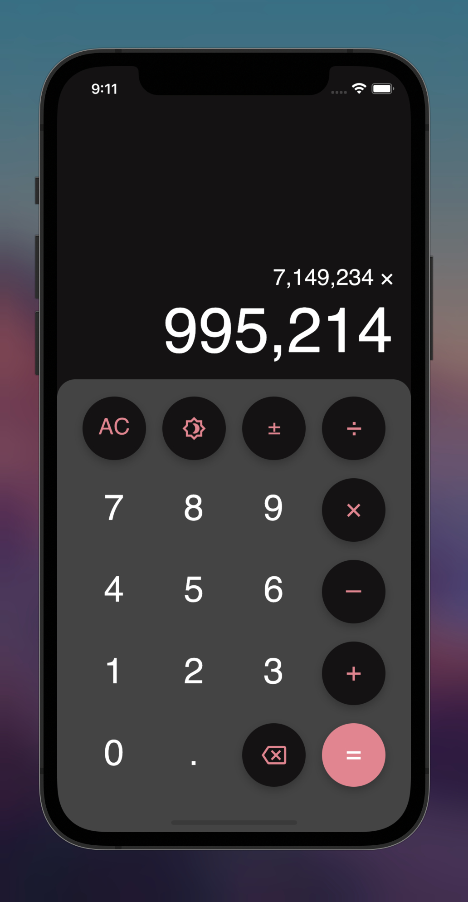
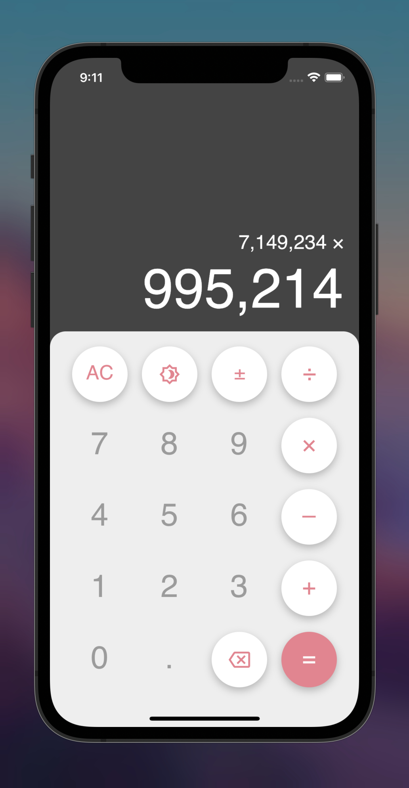

# The Calc App

**A basic calculator app for iOS and Android (made with Flutter)**

I would never have expected a simple calculator to be such an interesting project leaving me with an immense knowledge 
on flutter and the Dart programming language.

 

Some of the new things I learned include:
* State management using the Provider package and ChangeNotifier
* Extension methods
* Creation and Implementation of dark and light themes
* How to perform unit tests
* Optimization techniques such as Extracting Widgets

<!-- Screenshots -->

    
    

 

I can't wait to see what else Flutter has in store!